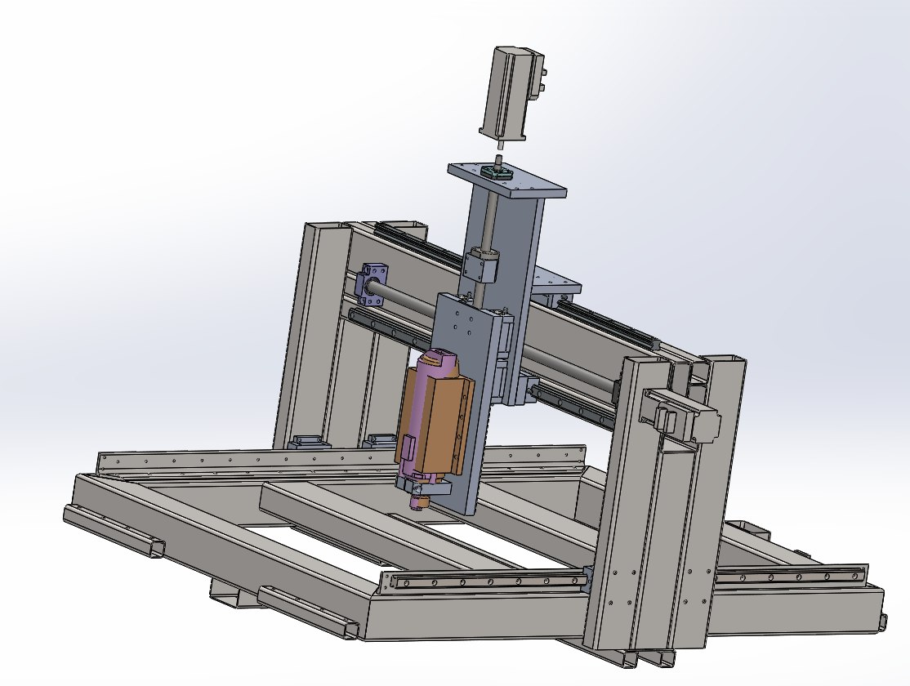

# 3-Achs-CNC-Fraese

Selfmade CNC-Mill for Aluminum, Wood and Steel milling

## Overview
To mill wood, aluminum and steel for future project, the desicion was made to design, construct a DIY-CNC mill. The basic concept is based upon an typical portal style cnc-mill, which is quite common in the diy world. To better stabilise and actualy mill aluminum and steel, the cnc is made out of steel beams. The mill has an work area of X500, Y700, Z150 milimeters. To drive the axis three iHSV57 servomotors with 180W each are used. The axes are guided by linear guides and driven by three ball screws. At the end of each axis there is a limit switch that can detect the end position. To control the axis, a MESA 7i76E is used, which is connected to an Intel NUC with an Ethernet cable. All three motors have a 36V power supply with max. 8.9 Ampere. The MESA card is operated with a 24V power supply. The control is done by Linux CNC.

## Work Progress
## 1. Create CAD Model 
A CAD model was created in Solidworks. Here, different concepts were first considered. In the end, I decided in favor of the steel body construction.

	

