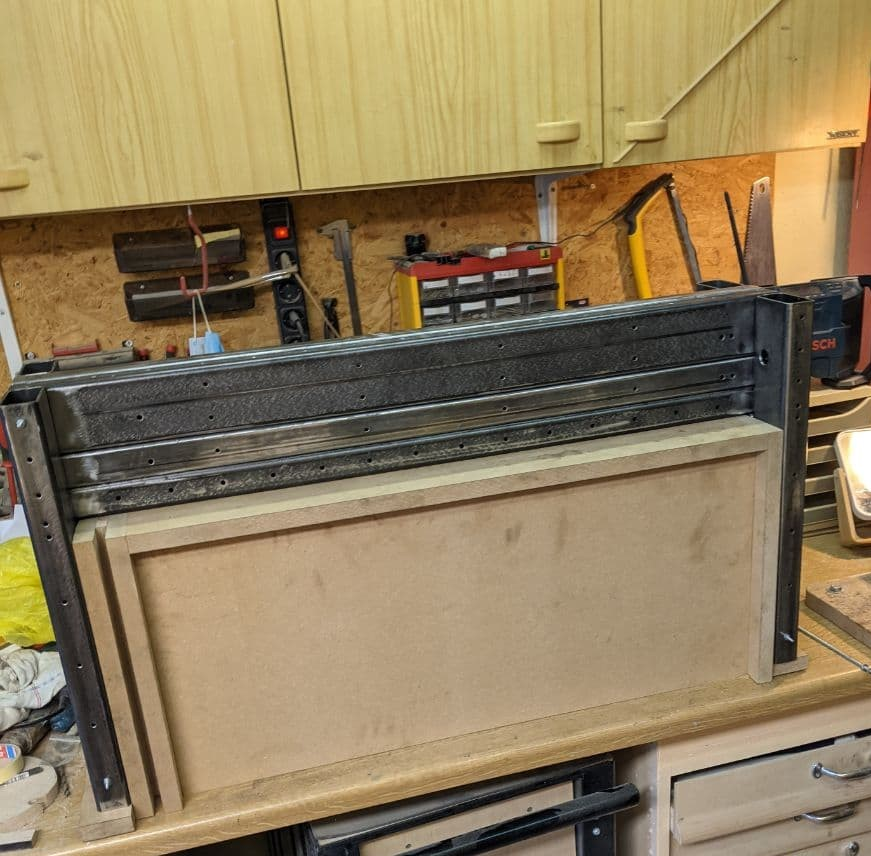
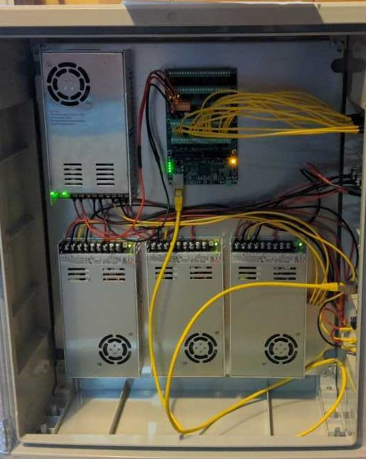
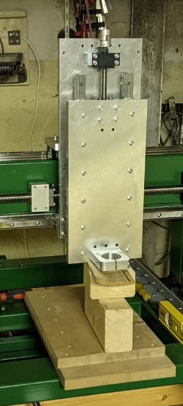
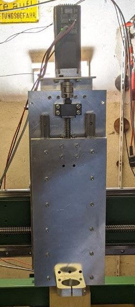
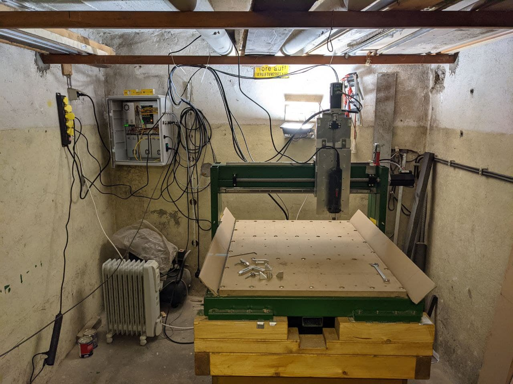
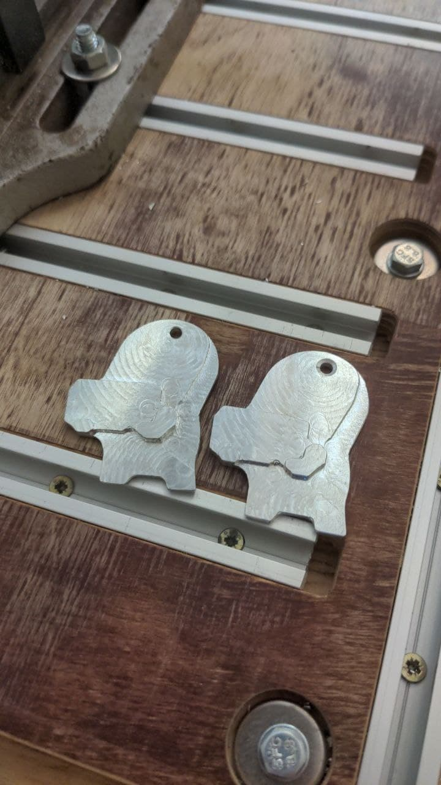
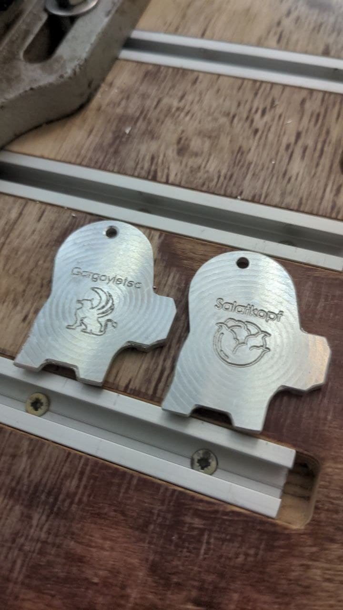

# 3-Achs-CNC-Fraese

Selfmade CNC-Mill for Aluminum, Wood and Steel milling

## Overview
To mill wood, aluminum and steel for future project, the desicion was made to design, construct a DIY-CNC mill. The basic concept is based upon an typical portal style cnc-mill, which is quite common in the diy world. To better stabilise and actualy mill aluminum and steel, the cnc is made out of steel beams. The mill has an work area of X500, Y700, Z150 milimeters. To drive the axis three iHSV57 servomotors with 180W each are used. The axes are guided by linear guides and driven by three ball screws. At the end of each axis there is a limit switch that can detect the end position. To control the axis, a MESA 7i76E is used, which is connected to an Intel NUC with an Ethernet cable. All three motors have a 36V power supply with max. 8.9 Ampere. The MESA card is operated with a 24V power supply. The control is done by Linux CNC.

## Work Progress
## 1. Create CAD Model 
A CAD model was created in Solidworks. Here, different concepts were first considered. In the end, I decided in favor of the steel body construction.

	

## 2. Weld and prime base frame 
The base frame was made of 80x80x3 square steel tubes. The cross braces are 100x50x3 square steel tubes. All tubes are welded together without much distortion as possible. After that the frame is sleeved for priming and then primed

	

## 3. Manufacture portal
The portal is not welded because the risk of something warping during welding is too great. Gluing was used as an alternative to welding. The gantry was also bolted to support the adhesive bond. For the gluing process, a wooden jig was built so that the portal can be glued perfectly square and in the correct position. The portal was also primed and painted.

	

## 4.First assembly
First assembly without fixed connection to detect errors in welding or bonding at an early stage.

	

## 5. Mounting of all spindles and linear guides
Finishing the painting and mounting the ball screw and carriages on the linear guides. Initially, only the y-axis was mounted on which the gantry is fixed. After the portal runs smoothly, the spindle and x-axis were mounted. 

	
	

## 6. Control cabinet 
Placement and wiring of all electronic components in the control cabinet.

	

## 7. Aligning the x-axis and y-axis and mounting z-axis
The x- and y-axes are aligned with each other and the z-axis was mounted to the carriage of the x-axis. The z-axis is also aligned perpendicular to the x-axis

	
	

## 8. Connecting the motors and first test run
Motors are connected to the control cabinet using XCT connectors. Limit switches are attached and connected to the axes and by checking the motor current it is determined whether the axes are all running smoothly.

	

## 9. First aluminum test part
As a first test component, two key fobs were designed in CAD and the milling program was programmed using HSMWorks. A 4mm end mill and a 45° engraving cutter were used for the part. As a first test component, two key fobs were designed in CAD and the milling program was programmed using HSMWorks. A 4mm end mill and a 45° engraving cutter were used for the part. The keychain is a game character from a video game.

	
	

